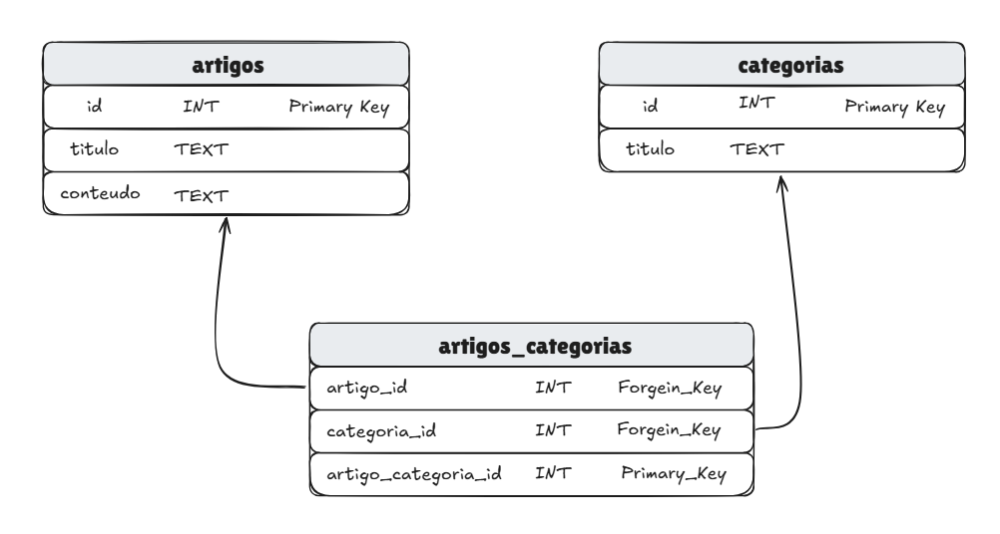

# Resolução dos Exercícios - Roteiro 14

---

## Exercício 1:

O **INNER JOIN**. Diferente do **LEFT JOIN** (que traz dados mesmo se o lado direito for nulo), o **INNER JOIN** exige que a condição de correspondência seja verdadeira nos dois lados, filtrando e eliminando os projetos que ainda não possuem detalhamento cadastrado.

**Query SQL:**

```sql
SELECT
  p.nome AS nome_projeto,
  d.descricao_longa,
  d.prazo_final
FROM projetos p
INNER JOIN detalhes_projeto d
  ON d.projeto_id = p.id
ORDER BY p.id;
```

---

### Exercício 2:

O banco de dados rejeita a segunda inserção porque a coluna projeto_id foi criada com a restrição UNIQUE.

Essa regra diz ao PostgreSQL: "Nesta tabela, nenhum valor nesta coluna pode se repetir". No momento em que tentamos inserir a segunda linha com o valor 3, o mecanismo de integridade do banco impede a gravação e gera um erro de violação de chave única. É isso que transforma conceitualmente a relação em 1:1, garantindo que um projeto nunca acumule mais de um registro de detalhes.

---

## Exercício 3:

**Query SQL:**

```sql
SELECT
  t.descricao AS tarefa_descricao,
  tg.nome AS tag_nome
FROM tarefas t
INNER JOIN tarefas_tags tt ON tt.tarefa_id = t.id
INNER JOIN tags tg ON tg.id = tt.tag_id
ORDER BY t.id;
```

---

## Exercício 4:

### 1. Tipo de Relação: **1:1**.

Estrutura: Uma chave estrangeira usuario_id na tabela perfis contendo a restrição UNIQUE e NOT NULL, apontando para a tabela usuarios.
Um cliente pode fazer vários pedidos, mas cada pedido pertence a um único cliente.

### 2. Tipo de Relação: **1:N**.

**Estrutura:** Uma chave estrangeira direta no lado "muitos" da relação. Ou seja, a tabela pedidos recebe uma coluna cliente_id INTEGER NOT NULL REFERENCES clientes(id).
Um artigo de blog pode ter várias categorias, e uma categoria pode agrupar vários artigos.

### 3. Tipo de Relação: **N:N**

**Estrutura de tabelas (Esboço):**

\*Ao invés da seta é um pé de galinha.

---

## Exercício 5:

### Metodo buscarPorId(id):

```js
async buscarPorId(id) {
  const resultado = await pool.query(
    `
      SELECT
        t.id AS tarefa_id,
        t.descricao AS tarefa_descricao,
        t.concluido AS tarefa_concluido,
        t.criada_em AS tarefa_criada_em,
        t.projeto_id,
        p.nome AS projeto_nome,
        tg.id AS tag_id,
        tg.nome AS tag_nome
      FROM tarefas t
      LEFT JOIN projetos p
        ON p.id = t.projeto_id
      LEFT JOIN tarefas_tags tt
        ON tt.tarefa_id = t.id
      LEFT JOIN tags tg
        ON tg.id = tt.tag_id
      WHERE t.id = $1
    `,
    [id]
  );

  if (resultado.rows.length === 0) {
    return null;
  }

  const primeiraLinha = resultado.rows[0];

  const tarefaMapeada = {
    id: primeiraLinha.tarefa_id,
    descricao: primeiraLinha.tarefa_descricao,
    concluido: primeiraLinha.tarefa_concluido,
    criada_em: primeiraLinha.tarefa_criada_em,
    projeto: primeiraLinha.projeto_id ? {
      id: primeiraLinha.projeto_id,
      nome: primeiraLinha.projeto_nome
    } : null,
    tags: []
  };

  resultado.rows.forEach(linha => {
    if (linha.tag_id) {
      tarefaMapeada.tags.push({
        id: linha.tag_id,
        nome: linha.tag_nome
      });
    }
  });

  return tarefaMapeada;
}
```
